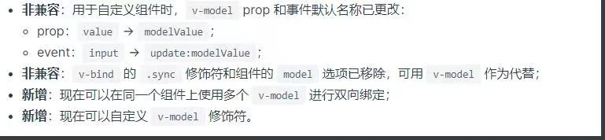
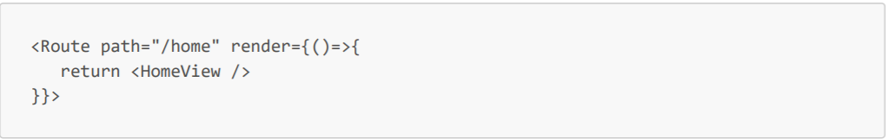

1. keep-alive组件有什么作用
    + 如果需要在组件切换的时候保存一些组件的状态防止多次渲染，就可以使用keep-alive组件包裹需要保存的组件
    + 对于keep-alive组件来说，它拥有两个独有的生命周期钩子函数，分别为activated和deactivated。用keep-alive组件包裹的组件在切换时不会进行销毁，而是缓存到内存中并执行deactivated钩子函数，命中缓存渲染后会执行actived钩子函数。
    + include字符串或正则表达式，只有名称匹配的组件会被缓存，exclude字符串或正则表达式，任何名称匹配的组件都不会被缓存
2. 说下vue生命周期钩子函数
    + beforeCreate 组件实例刚被创建，组件属性计算之前，如data属性等
    + created 组件实例创建完成，属性已经绑定，但DOM还未生成，$el属性还不存在。
    + beforeMount 模板编译/挂载之前
    + mounted 模板编译/挂载之后
    + beforeUpdate 组件更新之前
    + updated 组件更新之后
    + activated 用于keep-alive组件，组件被激活时调用
    + deactivated 用于keep-alive 组件被移除时调用
    + beforeDestory 组件销毁前调用
    + destoryed 组件销毁后调用
3. Vue中computed和watch区别
    + computed是计算属性，依赖其他属性计算值，并且computed的值有缓存，只有当计算值变化才会返回内容，不支持异步，在computed中属性有get和set方法，属性值是函数会走get方法，数据变化会调用set方法
    + watch监听到数据变化（props，data，computed内的数据）会执行回调并提供两个参数（newValue,oldValue），在回调中进行一些逻辑操作，没有缓存，支持异步。watch中有immediate（组件加载立即触发回调函数执行）和deep（深度监听数据变化，但无法监听到数组的变动和对象的新增）
    + Wacher源码的工作流程：
        1. 初始化组件上配置的watcher属性
        2. 对watcher属性可能的写法进行处理，得出key和handle函数
        3. 通过new Watcher来创建一个基于key和handle的观察者
        4. Watcher的key为响应式的vm中的变量，在watcher.get的时候，watcher订阅了对应key的变化，完成了响应依赖
        5. 当key的值发生了变化会触发watcher中的更新方法并执行回调函数handle
    + computed源码的流程：
        1. 初始化的时候会获取computed里的定义
        2. 通过便利第一步的结果，按照computed新变量名生成watcher实例
        3. computed的watcher默认是lazy的，所以new Watcher的时候不会调用watcher实例的get方法
        4. vue为computed里的每个key代理了一个新的get方法createComputedGetter(),当render页面的时候，新的get方法调用computed watcher实例默认get方法
        5. computed执行自定义get方法的时候会判断依赖有没有变动，没有变动的话直接取值，否则执行获取依赖的变量
        6. 获取依赖的变量时，将computed的watcher实例订阅到依赖变量的dep里
        7. 再调用计算列的watcher.depend将组件的watcher实例也订阅到计算列依赖的所有变量的dep中
        8. 这样，当变量发生变化时会通知computed的watcher将dirty设置为true，以及组件的watcher更新dom
4. React中的组件间通信都有哪些方式
    + 父传子：
        1. props传递
    + 子传父：
        1. 在父级中定义好回调，将回调传递给子组件，子组件执行回调并携带自身数据
    + 跨组件通信
        1. context
        2. redux
5. React中如何实现路由懒加载
    + 在React16中，新增了lazy方法，通过lazy方法可以轻松实现组件懒加载

    ```javascript
    const Clock=React.lazy(()=>{
        console.log("start importing");
        return import("./home")
        })
    ```

    React.lazy的参数是一个function，返回一个promise，这里返回的是一个import函数，webpack build的时候，看到这个东西就知道是个分界点，import里面的东西就可以打包到另外一个包里
    + lazy在真正使用的时候会配合着Suspense,lazy引入的动态组件必须放入Suspense中，Suspense的fallback属性是lazy组件没有加载进来之前的占位内容，这样只有在用户访问网站首页才会加载这个组件
    

6. React的生命周期函数都有哪些，分别有什么作用
    
    + constructor 接收props和初始化组件工作，发生在组件挂载时
    + static getDerivedStateFromProps 接受props和state，在组件创建时和更新时的render方法之前调用，无权访问class实例的this，接收props并会将返回的对象和state进行合并来更新状态
    + shouldComponentUpdate 接受nextProps和nextState，发生在组件更新时，判断是否应该发生更新如果应该发生更新就返回true，通过this.forceUpdate()更新的组件不会走shouldComponentUpdate
    + render 发生在组件挂载和更新阶段，纯函数根据组件的props和state返回一个React元素（虚拟dom），不负责组件实际渲染工作，之后由React自身根据此元素去渲染出页面Dom
    + getSnapshotBeforeUpdate 接受prevProps和prevState参数，发生在组件更新阶段被调用于render之后的预提交阶段，已经完成diff，可以读取但无法使用DOM的时候，它能在组件可能更新之前从DOM捕获一些信息（例如滚动位置），此生命周期返回的任何值都讲作为参数传递给componentDidUpdate
    + React更新DOM和refs 发生在组件挂载和更新阶段
    + componentDidMount 组件挂载到DOM后调用，且只会被调用一次
    + componentDidUpdate 发生在组件更新阶段，接受prevProps，prevState和getSnapshotBeforeUpdate的返回值作为参数，此方法在组件更新后被调用，可以操作组件更新的DOM
    + componentWillUnmount 发生在组件卸载阶段前，可以在这里执行一些清理工作，避免内存泄露

7. 说一下React Hooks在平时开发中需要注意的问题和原因？
    + 只能在React函数中使用（函数式组件或自定义hook），React将所有的hook函数定义在dispatcher中，并且在组件渲染时动态的将dispatcher分配给函数组件，并且在执行hook时会检查是否有dispatcher，如果没有会报错。
    + 只能在函数最外层调用hook，不能包括在if，for等语句中或者子函数中,React会将hook函数的值和更新函数存储在fiber的对象中，并且会按照hook的注册顺序进行存储值，对应的更新函数只会更新对应位置的值。在组件更新时解析到hook函数时会到fiber对应存储hook对象的对应位置去查找是否有值，如果没有值会去读初始值并且存储初始值返回初始值和更新函数，如果有值会去读取存储值并返回存储值和更新函数
    + useState中存储的是引用类型的数据时，修改state时，一定要返回新的引用，React会在更新时进行值的浅对比，如果浅对比不通过不会进行更新
8. React的setState方法是异步还是同步
    + 在原生事件和计时器里的setState方法是同步的
    + 在合成事件和React方法中的setState方法是异步的
    + react会在执行更新时根据上下文执行环境来决定如何更新，默认isBatchUpdate为true，如果是在React生命周期或者是合成事件的上下文执行环境时这种React能够检测到的地方执行更新，React会执行BatchUpdate进行批量更新，在生命周期执行完成会将isBatchUpdate设置为false也就不会执行批量更新了，而如果在异步里执行setState方法，在你执行的时候上下文环境已经重新等于noContext会立即更新不会进行批量更新
9. 有没有写过Koa中间件，说下中间件原理，介绍下自己写过的中间件？
    + koa中间件本质上就是函数可以是一个async函数，也可以是一个普通的函数
    + 中间件会遵循洋葱模型，中间件执行顺序并不会是从头到尾执行，而是会先执行最外层中间件，当在外层中间件内部调用next()函数后进入内层中间件执行，一路执行到最里层中间件，然后从最里层执行到最外层
10. 如何判断当前脚本运行在浏览器还是node环境中？
    + 可以通过判断在浏览器端或者在node端的独有的全局对象来区分环境

    ```javascript
    if(typeof process !== "undefined"){
        console.log("node");
    }else{
        console.log("浏览器")
    }
    ```

11. 请描述一下cookies，sessionStorage和localStorage区别
    + cookie
        1. 其实cookie是一些数据，存储于电脑上的文本文件中。
        2. 当web服务器向浏览器发送web页面时，在连接关闭后，服务端不会记录用户的信息。而cookie的作用就是用于解决“如何记录客户端的用户信息”这个问题
        3. 当用户访问web页面时，他的名字可以记录在cookie中。在用户下一次访问该页面时可以在cookie中读取用户的访问记录
        4. cookie以键值对的形式存储，username=wuyou；，当浏览器请求服务器时，属于该页面的cookie会被添加到该请求头中。服务端通过这种方式来获取用户的信息，如果使用cookie保存过多数据会带来性能问题
        5. cookie一般由服务器生成，可设置失效时间，如果在浏览器生成cookie默认是关闭浏览器后失效，存放大小一般4K左右
    + localStorage和sessionStorage
        1. 在客户端生成，大小在5m左右
        2. localStorage除非被清除，否则会永久保存，sessionStorage仅在当前会话下有效，刷新页面数据依旧存在，关闭页面或者浏览器会被清除。
        3. localStorage和sessionStorage仅在客户端中保存，不参与和服务器的沟通
        4. 目前所有的浏览器都会把localStorage的值类型限定为string类型，这个在我们日常比较常见的json对象类型需要一些转换
        5. localStorage本质上是对字符串的读取，如果存储内容多的话会消耗内存空间导致页面变卡
        6. localStorage不能被爬虫抓取到
        7. localStorage在浏览器的隐私模式下是不可读取的，并且浏览器给的空间大小不统一，IE8以上才有
        8. localStorage遵循同源策略，推荐使用setItem写入数据，getItem读取数据，removeItem清除数据，clear清除所有数据
        9. sessionStorage不会跨标签页存储，而localStorage会跨标签页存储
12. 介绍一下node常用模块，并且详细介绍下stream？
    + http模块，构建本地服务器
    + websocket 实时聊天
    + fs模块 文件系统
    + cherrio 是jq核心功能的一个实现，主要是为了在服务器端对dom进行操作
    + stream
        1. 流是一种抽象数据结构，可以用它来读取和写入数据，通过流来读取和写入数据可以防止内存溢出，采用流方式处理数据会把数据分成64k的小块数据，异步依次来进行传递，更加节约性能
        2. Stream有四种流类型，Readable-可读操作，Writable-可写操作，Duplex-可读可写操作，Transform-操作被写入数据，然后读出结果
        3. 所有的Stream对象都是EventEmitter的实例，常用的事件有data-当有数据可读时可触发，end-没有更多的数据可读时触发，error-在接受和写入过程中发生错误时触发，finish-所有数据已经被写入到底层系统时触发
        4. 在stream中默认使用buffer二进制。在i/o（input/output）操作中，数据格式未知，字符串、音频、网络包， asc编码 utf8编码二进制无论那种格式都支持，而且效率非常高
        5. 在文件下载等场景我们如果使用fs需要先将文件完全加载到内存中才能操作，浪费了大量内存和时间，而使用流可以当有一点数据的时候处理一点数据，处理完成就发送出去既减少内存开销又减少时间开销
13. Node如何和mysql进行通信
    + 可以借助一些sql相关模块实现node和mysql数据库的通信
        1. 安装mysql2模块
        2. 链接数据库

        ```javascript
        const mysql = require('mysql2'); 
        const connection = mysql.createConnection({ 
        host: 'localhost', //主机地址 
        user: 'root', // 数据库用户名 
        database: 'test' //数据库名称
        });
        ```

        3. 通过query来执行sql语句

        ```JavaScript
        connection.query( 'SELECT * FROM table WHERE name = "Page" AND age > 45', 
        function(err, results, fields) {
        console.log(results); // 查询到的结果 
        console.log(fields); // 获取字段的相关信息
        } );
        ```
        4. node本身是没有提供直接操作数据库的api的，我们可以通过c或则c++ 来操作（mysql官网有提供）再通过node解析引擎中的binding机制来调用这个c或则c++写的库
        
14. 浏览器为什么要阻止跨域请求？如何解决跨域？每次跨域请求都需要到达服务端吗？
    + 浏览器阻止跨域请求的原因是同源策略，同源策略主要解决的问题是安全问题
    + 同源是协议，域名，端口号都相同
    + 非同源会造成的问题是无法发生请求，无法获取cookie，localStorage，indexDB以及无法访问页面中的dom
    + 跨域解决的方法
        1. jsonp跨域
        首先在要跨域的文件中创建一个回调函数，动态添加script标签向服务器发送请求请求地址后面加上查询字符串，通过回调函数的参数指定回调函数的名字 然后在后端的文件中调用这个回调函数，并且以json的数据形式作为参数传递，完成回调，不支持post请求
        
        2. postMessage解决跨域（用于浏览器端窗口跨域 ）
        postMessage是只存在于浏览器端窗口跨域 这个是HTML5中新引入的API
        接收两个参数，第一个参数是具体的信息内容， 第二个参数是接收消息的窗口的源，也就是协议 + 域名 + 端口，也可以直接设置为*。表示不受域名限制，向所有窗口发送
        3. 跨域资源共享（CORS） 
        4. nginx 反向代理 
        通常如果代理的是客户端那就是正向代理，如果代理的是服务器那就是反向代理
        5. nodejs中间件正向代理 
        6. websocket协议跨域（用于客服端和服务端的 ）
15. token一般存放在哪里？token放在cookie和放在localStorage，sessionStorage中有什么不同？
    + token其实就是访问资源的凭证，一般是用户通过用户名和密码登录成功之后，服务器将登录凭证做数字签名，加密之后得到的字符串作为token，然后在用户登录成功之后会返回给客户端
    + token在客户端的存储方式
        1. 存储在localStorage中，每次调用接口的时候都把它当成一个字段传给后台
        2. 存储在cookie中，让它自动发送，缺点是不能跨域
        3. 存储在localStorage中，每次调用接口的时候放在http请求头的Authorization
    + 将token存放在webStorage中的话可以通过同域的js来访问，容易导致xss攻击，尤其是项目中引入了第三方js类库，如果js脚本被盗用那攻击者就可以轻易访问你的网站，webStorage作为一种存储机制在传输过程中是不会执行任何安全标准的
    + 将token存储在cookie中，可以在后端指定httponly，来防止被js读取，也可以指定secure，来保证token只在https下传输，缺点是容易受到csrf攻击
16. Websocket是怎么实现点对点通信和广播通信的
    + websocket是一种全双工通信协议，让服务器和客户端通信变得简单，最大的特点就是可以通过服务器主题推送消息到客户端
    + 以socket.io模块举例
    
    点对点通信就是一对一的通信，例如可以指定用户来发送消息，点对点通信中需要注意服务器记录每个socket客户端连接，需要将客户端id及当前客户端在服务端的socket对象关联起来，广播数据的时候广播指定的对象就可以了
    
17. 客户端缓存有几种方式?浏览器出现from disk、from memory的策略是啥?
    + 客户端缓存主要分为http缓存和本地缓存
    + 本地缓存就是webStorage和cookie以及indexDB，indexDB是一种底层API，用于在客户端存储大量的结构化数据
    + http缓存中的强缓存和协商缓存
        1. 强缓存的缓存规则：浏览器在请求某一资源时，会先获取该资源缓存的header信息，判断是否命中强缓存（cache-control和expires信息）若命中直接从缓存中获取资源信息，包括缓存header信息，本次请求就不会与服务器进行通信，Cache-Control与Expires他们的作用是一样的，都是指明当前资源的有效期，Expries是http1.0的标准，在HTTP/1.1之后被Cache-Control替代 Cache-Control的选择更多，如果同时设置的话，其优先级高于Expires
        
        
        Cache-control有很多字段可以设置
        Public：指示响应可被任何缓存区缓存。
        Private：所有内容只有客户端可以缓存，也是Cache-Control的默认取值。
        no-cache：客户端缓存内容，但是是否使用缓存则需要经过协商缓存来验证决定
        no-store：所有内容都不会被缓存，即不使用强制缓存，也不使用协商缓存
        max-age：也就是刚刚上面例子中用到的，max-age=xxx ：缓存内容将在xxx秒后失效。
        min-fresh：指示客户机可以接收响应时间小于当前时间加上指定时间的响应。
        max-stale：指示客户机可以接收超出超时期间的响应消息。如果指定max-stale消息的值，那么客户机可以接收超出超时期指定值之内的响应消息。
        2. 协商缓存的标识也是在响应报文的HTTP头中和请求结果一起返回给浏览器的，控制协商缓存的字段分别有：Last-Modified / If-Modified-Since和Etag / If-None-Match，其中Etag / If-None-Match的优先级比Last-Modified / If-Modified-Since高
18. 说一下 CORS 的简单请求和复杂请求的区别?
    + 非简单请求时在cors的时候会先发一个option去嗅探
    + Access-Control-Allow-Origin ：指示请求的资源能共享给哪些域。 
    Access-Control-Allow-Credentials：指示当请求的凭证标记为true 时，是否响应该请求。 
    Access-Control-Allow-Headers：用在对预请求的响应中，指示实际的请求中可以使用哪些 HTTP 头。 
    Access-Control-Allow-Methods ：指定对预请求的响应中，哪些 HTTP 方法允许访问请求的资源。 
    Access-Control-Expose-Headers：指示哪些HTTP头的名称能在响应中列出。 
    Access-Control-Max-Age ：指示预请求的结果能被缓存多久。 
    Access-Control-Request-Headers：用于发起一个预请求，告知服务器正式请求会使用那些HTTP头。 
    Access-Control-Request-Method： 用于发起一个预请求，告知服务器正式请求会使用哪一种HTTP请求方法。
    Origin ：指示获取资源的请求是从什么域发起的。
    + 满足以下情况是简单请求
        1. 看HTTP方法HEAD、GET、POST这三种
        2. 看HTTP头信息，不超出这几种字段Accept、Accept-Language、Content-Language、Last-Event-ID、Content-Type，其中Content-Typede的值只能是：application/x-www-form-urlencoded、multipart/form-data、text/plain
        3. 只要不是简单请求那就是复杂请求
    + 复杂请求表面上看起来和简单请求使用上差不多，但实际上浏览器发送了不止一个请求其中最先发送的是一种"预请求"，也就是options 此时作为服务端，也需要返回"预回应"作为响应，预请求实际上是对服务端的一种权限请求，只有当预请求成功返回，实际请求才开始执行
19. 节流和防抖分别是什么？在什么场景下使用？请分别实现一个节流函数和一个防抖函数
+ 防抖函数是防止类似于手抖行为导致多次事件执行，所以在一定时间之内只可以执行一次，如果在规定时间内重新触发了函数会重置定时器直至在规定时间内不再有新事件的触发才会执行函数。

+ 节流函数是可以执行多次函数，但是规定在一次时间间隔内只能触发一次函数

20. 怎么禁止让js读取cookie？怎么让cookie只在HTTPS下传输？
    + 由于cookie会存放在客户端，一般情况下会保存一些凭证及状态信息，为了防止cookie泄露造成安全问题。可以这只cookie的 HttpOnly属性，那么通过程序(JS脚本、Applet等)将无法读取到Cookie信息，这样能有效的防止XSS攻击。
    + cookie中有个属性secure，当该属性设置为true时，表示创建的Cookie会被以安全的形式向服务器传输，也就是只能在HTTPS连接中被浏览器传递到服务器端进行会话验证，如果是HTTP连接则不会传递该cookie信息，所以不会被窃取到Cookie的具体内容。就是只允许在加密的情况下将cookie加在数据包请求头部，防止cookie被带出来。secure属性是防止信息在传递的过程中被监听捕获后信息泄漏。
21. v-if和v-for为什么不能连用？
    + vue2中v-for比v-if优先，如果每一次都需要遍历整个数组，将会影响速度，尤其是当之需要渲染很小一部分的时候 。可以采取多层包裹来解决性能损耗问题。例如外层包裹template给标签绑定指令v-if或者是使用计算属性过滤展示数据
    + vue3中 v-if的优先级高于v-for
22. 单页面应用和多页面应用区别及优缺点?
    + 单页面应用（SPA），单页面每一次页面的跳转是通过js把当前页面数据删除，然后渲染新的dom结构，跳转仅刷新局部资源，公共资源（js，css等）仅需加载一次
        + 优点：
            + 用户体验好，响应快，对服务器的压力小
            + 容易进行前后端分离
        + 缺点：
            + 不利于seo
            + 导航不可用，需要自己实现导航
            + 首屏渲染时间慢（需要进行大量的请求）
            + 页面复杂度高
    + 多页面应用，每一次页面的跳转客户端都会返回一个新的html
        + 优点：
            + 多页面应用对于seo更加友好
            + 首屏渲染时间快
        + 缺点：
            + 页面切换慢，用户体验差
            + 增加服务端压力
23. v-model 该如何实现？
    + v-model本质上是v-on和v-bind的语法糖。我们可以使用这个指令在表单元素上创建双向数据绑定，可以监听到用户的输入事件来更新数据
    + v-model在内部为不同元素抛出不同的事件，如：input和textarea元素使用value属性和input事件；checkbox和radio使用checked属性和change事件；select字段将value作为prop并将change作为事件
    + v-model作用在普通表单上
    ```javascript
    <input v-model="myvalue" />
    //等同于
    <input v-bind:value="myvalue" v-on:input="myvalue=$event.target.value">
    ```
    + v-model作用在组件上
    ```javascript
    <mycom v-model="myvalue" ></mycom>
    //等同于
    <mycom :value="myvalue" @input="(e)=>{myvalue = e}" ></mycom>
    //父组件
    new Vue({  el: "#app",  components:{   mycom  },  data: {    myvalue: "123"  }})
    //子组件
    let mycom = {props:['value'],template:`<div><input :value="value" @input="fn" /></div>`,methods:{ fn(e){ this.$emit('input',e.target.value) }}}
    ```
    + vue3中的v-model
    
    + vue3取消了.sync修饰符的使用，直接使用v-model进行替换即可。对于自定义组件使用v-model时，prop与事件的默认名称变更，从vue2版本的value/@input变更为modelValue/@update:modelValue。修改model的名称从原来的model选项进行修改，变更为传递参数给model，写法为v-model:argument。使用v-model参数后会改变prop和事件名为argument/@update:argument。现在一个组件可以同时使用多个v-model进行绑定。并且在vue3中v-model支持自定义修饰符，他将会通过props中的modelModifiers属性接收。
    
    
    + 不可以使用vue2版本的方式配置model名称，v-model参数是一个不向下兼容的改动，在vue3中修改model的名称就是通过v-model参数进行修改
    + 绑定多个v-model的时候只要传参对model名称进行变更，每个v-model将会同步到不同的prop属性当中，所以并不需要在组件中添加额外的选项进行配置
24. vue2中为什么检测不到数组的 变化，如何解决?
    + 由于由JavaScript 的限制，Vue 不能检测数组变动。解决方案是通过全局Vue.set或者用实例方法vm.$set来修改。同样也可以通过变异方法splice来修改数组触发数据响应式。
    + 
    + 主要是vue2中使用object.defineProperty来监听对象属性的变化不健全导致的，所以重写了数组的方法实现了响应式，vue3中使用proxy代理数据变化解决了问题，
25. 在React项目中，想要进行逻辑复用,有哪些方案？
    + HOC（高阶组件）、render props、hooks
        1. HOC
        类似于高阶函数，在使用高阶组件时，传入一个组件，会返回一个组件。 举个我们使用频率比较多的例子 - withRouter
        
        withRouter这个高阶组件的作用就是复用传递给视图组件路由信息这个逻辑
        2. hooks
        hooks 的出现，主要目的就是解决逻辑复用问题。相比于高阶组件，hooks的使用更灵活，更自由。 已 Router 的hooks对比 withRouter。使用 withRouter时，会一次性将路由所有相关数据导入组件，而 hooks 我们按照需求只导入 location 或 history 等。 另外一个组件中，要复用多个逻辑时，高阶组件明显使用起来就比较不便。 比如在 Acmp 组件中，我们既需要使用 Redux 相关数据，又需要路由信息时，结果如下：
        
        导致每次复用一个逻辑都需要额外包一层，非常的不方便，高阶组件可以做的事情，hooks都可以去做，而且 hooks 的使用比高级组件更灵活也更方便，但是hooks 只能用在函数组件下。  
        3. render props
        render props 同样是 react 中，复用逻辑的小技巧，并不是标准定义的 API。 简单来说，就是组件具有一个render 属性，该属性接收的是一个函数，该组件中要渲染的视图是 render 属性的返回值。 举一个我们使用最多的常见，Route 组件的 render 属性
        
        Route组件中的这个render属性就是一个关于render props的实际应用。 将组件内要渲染的视图放在 render属性的返回值中，而组件本身是一个路由逻辑的共用。 这样就做到了功能复用而视图自定义
        Route 简易原理如下：
        
    + 高阶组件或hook，通常用在单一的逻辑复用，比如实时获取当前滚动条位置，或定义state，副作用处理等，都是单一的逻辑。 而 render props 通常是一个完整的功能复用，只是该功能中视图或部分视图需要由使用者定义，比如，弹窗功能，路由功能 等，项目中使用到这些功能的地方有很多，但是使用时，视图可能有差异。
26. 在React中，针对类组件和函数组件，分别怎么去进行性能优化？
    +  组件优化除了最基础的key之外，主要考察点在于优化组件更新。 React 中，如果组件更新了，会携带它的子孙级组件一起进行更新，虽然组件更新时，会有diff约束DOM更新。 但组件更新时的 diff，也会消耗很多性能。 如何避免项目中不必要的组件更新就是我们必须要面对的问题。 如果是类组件我们可以使用 shouldComponentUpdate 或者PureComponent（对props和state进行浅比较） , 函数组件则可以使用 memo（对props和state进行浅比较） 
27. Vue3中Teleport的作用是什么
    + 他的作用就是将一个嵌套在组件内部的某些内容可以渲染到当前组件外部,允许我们控制在dom中哪个父节点下渲染html。
    + 假设我们有一个modal组件，该组件分为触发modal打开的button以及模态框本体，当我们需要给模态框position: absolute时，其会以其定位父级也就是含有相对定位的div进行偏移，同时将会受到其父级样式影响。此时我们就只能将组件拆分为两个组件或者用一个其他的全局状态进行控制。如果使用teleport就可以将modal渲染到body标签内，避免上述困扰
    ```javascript
    <div style="position: relative;">  
        <button @click="modalOpen = true">Open full screen modal!</button> 
        <telepot to="body">  
            <div v-if="modalOpen" class="modal">   
                <div> 
                I'm a modal!     
                <button @click="modalOpen = false">Close</button> 
                </div>
            </div>
        </telepot>
    </div>
    ```
    + 当teleport包含的是vue组件时，只是将该组件渲染到对应的标签当中，他的props等依然是从该组件的父组件进行注入
    + 可以使用多个teleport指向同一标签,就比如有一个复用的modal组件，他在多个地方被使用时会被指向相同标签比如body。这时将会按照顺序进行追加，后挂载的元素会在较早挂载元素之后的位置
    + 给teleport的to传入字符串的时候,其实也就是传入一个选择器，它的底层会调用 document.querySelector() 这个方法
28. 说一下vue3的composition api?
    + composition api意为组合式api，其主要是代码组织结构上的变动。vue2版本的options api，通过一个配置集合将代码划分为多个部分，使得代码组织结构比较清晰，比如父组件直接传入的数据存放于props，方法存放于methods等，但是其代码逻辑复用方面一直表现得不是很友好。composition api就是用于解决该问题，在vue3当中新增加了一个生命周期函数为setup。setup将在创建组件之前被执行，一旦props被解析时，setup将服务于composition api充当入口点。从使用角度来讲composition api主要有以下几点与options api不同
        1. 响应式数据声明改变，通过ref/reactive两个方法均可以声明响应式数据，但是两者使用方式略有不同。ref所声明的响应式变量将会返回一个包含有value属性的对象，value的值就是该响应式变量所对应的值。所以在不论在获取还是改变ref声明的响应式变量时都需要通过.value进行操作。reactive返回的则是通过Proxy处理后的对象。
        
        2. 使用生命周期函数时，变为从vue中引入对应生命周期函数例如onMounted，生命周期函数接受一个函数作为参数，该函数将会在对应生命周期阶段被执行。
        3. watch使用方式改变，watch作为函数接受至少两个参数，第一个参数为被watch的响应式数据，第二个参数为回调函数。当watch接受的响应式数据不同会有不同的使用方式，当watch的数据为通过ref声明的响应式变量时，watch直接接受ref响应式变量如watch(refValue)。当watch数据为通过reactive声明时，需要传入一个函数，该函数返回reactive变量如watch(() => reactiveValue.value)。同时新增watchEffect，他会收集内部依赖，当内部依赖发生改变时就会被执行。
        4. props现在作为setup的第一个参数进行接收，使用props时可以通过vue暴露的toRefs方法将props上的属性转为独立的ref响应式变量，从而进行使用。
        5. 在setup当中代码将可以根据功能进行组织并提取，这极大程度的解决了以往代码可读性较低以及逻辑服用难的缺点。
    + composition api并不被强制使用，他只是在大型项目中对于代码复用以及逻辑提取上有很大的优点，并且他极大的提高了代码可读性。vue3是向下兼容的，在vue3当中依然可以通过options api进行开发。同时尤大本人曾在Vue Mastery上表示过，对于新手来讲，options api的学习可能对于上手vue来说更加快速
    + 不可以在setup中通过this来使用实例上的属性，因为setup执行是在组件创建之前，这时还并没有组件实例，所以在setup中并没有this，如果希望使用一些实例上的方法，可以通过getCurrentInstance方法先获取实例在进行操作。
29. 说一下 Vue3 与 Vue2 的对比？
    + 首先从性能层面讲，vue3不论是渲染速度或是打包速度均快于vue2，这里有以下几个原因数据劫持方式改变，原有通过Object.defineProperty进行的数据劫持改变为Proxy进行数据代理。由于Proxy可以动态判断该数据是否为深层嵌套数据，而Object.defineProperty为遍历全部深层嵌套数据，导致两者仅在数据劫持上就产生了极大的时间差距。
    + vue3打包策略，vue3支持了tree-shaking，即排除任何未实际使用的代码，打包体积极大缩小。同时由于打包后体积缩小文件数量减少，页面加载文件所需时间也极大缩短。
    + diff优化，vue3中会对静态节点进行提升，所有静态节点(及不包含任何响应式数据及事件等)在进行比对时不会被遍历。这促使vue3在进行节点比对时所需的比对时间大幅减少。
    + 性能之后还有生命周期的改变，vue2中的beforeCreate与created被setup一个生命周期所替代，同时beforeDestroy与destroyed分别改名为beforeUnmount与unmounted所替代。
    + 同时vue3当中的响应式数据声明也有所改变，但这主要体现与在setup中进行响应式数据的声明。vue3当中暴露了两个方法，分别是reactive与ref方法。他们均是用来声明响应式数据，只是对于不同情况有各自的有点。
    + 由上面一点可以引出vue3当中发生的最大改变 - composition api。vue3的代码组织有以前的options api切换到了composition api，这使得我们在处理大型项目时不会再像以前一样，一个功能的代码将被分割到data、computed、method等等当中，我们可以将相同功能代码提出进行封装，这极大提高了代码可读性
    + 除此以外vue3中双向绑定也进行了修改。vue3中取消了v-bind的.sync修饰符，因为这更符合v-model的逻辑。v-model主要有以下两点不同：一个组件可以同时包含多个v-model，model名称的更改由之前的model选项变更为传递一个参数给model，传参方式为v-model:argument。当v-model用于自定义组件时，prop与事件的默认名称由以前的value/@input变更为modelValue/@update:modelValue。如果使用了v-model参数改变了model名字，比如v-model:title，则对应prop与事件名称为title/@update:title。
    + vue3对ts的支持程度也是vue2所不能达到的，例如vue3当中提供了一个defineComponent，他能为props提供完整的类型推断。
30. 在组件的通信中EventBus非常经典，你能手写实现下EventBus么？
    
    按钮在点击的时候，我们通过EventBus去发送一个消息,下面的EventBus.on方法里面能监听到事件被触发，并且还需要传递一些参数过来
    + 核心逻辑实现其实就是一个观察者模式
    
31. 请介绍一下装饰者模式，并实现？
    + 在传统的面向对象语言中，给对象添加功能常常使用继承方式，但是继承方式不灵活，一方面会导致超类和子类之间存在耦合，当超类改变时，子类也会随之改变。另一方面，继承这种功能复用方式被称为白箱复用，超类内部细节是对子类可见的，继承被认为破坏了封装性，而且在完成一些功能复用时会创建出大量的子类，使子类的数量呈爆炸性增长。
    + 装饰者模式能够在不改变对象自身的基础上，在程序运行期间给对象动态地添加职责
    ```javascript
    class luban {  
        fire(){    
            console.log('这里是基础伤害');
        }
    }
    ​class firstSkill{  
        constructor(luban){    
            this.luban = luban;  
        }  
        fire(){    
            this.luban.fire();    
            console.log('发射手雷');  
        }
    }
    ​var luban1 = new luban;
    luban1 = new firstSkill(luban1);
    luban1.fire();
    ```
    
    
32. 了解js中设计模式吗？动手实现一下单例模式？
    + 单例模式的核心思想就是限制类实例化次数只能一次，一个类只有一个实例，并提供一个访问它的全局访问点，在全局作用域任何地方都可以访问这个实例。
    + 使用一个变量存储类实例对象（值初始为 `null/undefined` ）。进行类实例化时，判断类实例对象是否存在，存在则返回该实例，不存在则创建类实例后返回。多次调用类生成实例方法，返回同一个实例对象。
    
33. 虚拟 DOM 有什么作用，如何构建虚拟DOM？
    + 实际上它只是一层对真实DOM的抽象，以JavaScript 对象 (VNode 节点) 作为基础的树，用对象的属性来描述节点，最终可以通过一系列操作使这棵树映射到真实环境上
    + 在Javascript对象中，虚拟DOM 表现为一个 Object对象。并且最少包含标签名 (tag)、属性 (attrs) 和子元素对象 (children) 三个属性，不同框架对这三个属性的名命可能会有差别
    + 创建虚拟DOM就是为了更好将虚拟的节点渲染到页面视图中，也可以为跨平台迁移试图做铺垫，所以虚拟DOM对象的节点与真实DOM的属性一一照应
    + 操作真实DOM在性能的耗费上面可以说是非常之大的
        1. 为了让 Web 编程模型保持简单，浏览器的 JavaScript 引擎与 DOM 引擎共享一个主线程。任何 DOM API 调用都要先将 JS 数据结构转为 DOM 数据结构，再挂起 JS 引擎并启动 DOM 引擎，执行过后再把可能的返回值反转数据结构，重启 JS 引擎继续执行。这种上下文切换很耗性能，类似的还有单机进程间调用、远程过程调用等。
        2. 很多 DOM API 的读写都涉及页面布局的“重新计算”，以确保返回值的准确，涉及样式、结构的还会触发页面“重新绘制”，更耗性能。
    + 简单实现：
    ```javascript
    class Vdom{    
        constructor(option){        
            this.tagName = option.tagName;        
            this.props = option.props || {};        
            this.children = option.children || '';
        }
        render(){        
            let el = document.createElement(this.tagName);       
            for(let propsKay in this.props){            
                el.setAttribute(propsKay,this.props[propsKay])        
            }       
            if(Array.isArray(this.children)){            
                this.children.forEach((item)=>{                
                    el.appendChild(item.render());            
                })
            }else{
                el.innerText = this.children
            }
            return el;
        }
    }
    ```
34. React中的diff是怎样的？
    + React diff用于等比新旧DOM树的差异，简单来说也可以说是对比两个Object tree 之间的差异。
    + 那么当虚拟dom发生变化之后 视图如何做到最小化更新呢 ？这个时候diff就起到了关键的作用 。更新前后diff会对比 Object tree 之间的差异 。 然后会标记更新差异的区别.
    + 新旧object tree 差异主要会有6种 ，如下
        1. 替换节点
        2. 替换属性
        3. 添加新节点
        4. 移动节点或者说插入节点
        5. 删除节点
        6. 修改文本节点内容
    + 为了减少diff的成本会采取同层比较的策略  。不会采取跨层对比的方式 。 然后采取递归方式  逐层的对比 每层差异 。同时也会标记 新旧 节点的增删改查等操作方便后续的视图更新，如下图
    
    + 具体diff代码实现如下
    
    上述是对单个节点的对比过程，在对比单个节点时，最后通过 diffCmp 组件对比，或者 diffChildren 子元素对比，接着向下递归。接下来先来看看 diffCmp
    
    看完了 diffCmp 之后，我们先来看 diffProps 属性对比，了解属性对比的过程之后，再学习 diffChildren 会更直观一些。虚拟DOM 中的属性，其实就是一个普通的 object 对象，在其中会有三种不同的操作，需要我们在对比时进行考虑：
        1. 新增属性
        2. 删除属性
        3. 属性值变动
    
    从上述代码中，我们可以通过两个循环，我们就可以将属性中有差异的内容给找出来。第一步，先循环更新后的 props ，如果在更新的 props 中也有对应属性，则比较属性值是否有变化。如果在更新前的 props 中，不存在对应属性，则该项为新增属性。第二步。循环更新前的props，如果在更新后的 props 不存在对应属性，则该项属性需要被删除。看完了属性对比之后，我们来看一下最复杂的子元素对比。这里我将 children 做了简化，React 中 children 有可能存在 单个数据、数组、复合数组多种情况。我们这里主要看最麻烦的数组的形式。还是来分析在一组子元素对比时，我们要做哪些对比。
        1. 新增元素
        2. 删除元素
        3. 元素位置变化
        4. 递归对比单个元素
    我们可以利用key属性，将children转成对象用key唯一标识一个child，这样的话，就可以将 diffProps 的逻辑嵌套入diffChildren中来：
    
    现在我们还差最后一步，如何找到哪些元素的位置，发生了变化。来看一个思路： 默认情况下，后一个的索引值，不小于前一个元素，如果元素的下标符合这个原则，那则代表元素的位置没有发生变化。举个例子。 更新前的列表：a(0) b(1) c(2) d(3) 更新后的列表: b a d c这里有一个列表更新前后位置产生了变化，如果将发生移动的元素找出来，我们套用上边的思路，来看一下。第一步声明一个变量 lastIndex = 0;使用 lastIndex 先和 b 元素进行对比，b 元素的下标为 1，lastIndex 为 0. 1 不小于 0 ，符合规则，b 位置不变。lastIndex 变成 1，接着和下一个元素进行对比。使用 lastIndex 和 a 比较，a 下标为 0，lastIndex 为 1，不符合规则，记录 a 的位置发生了变化。接着对比下一个元素使用 lastIndex 和 d 比较，d 下标为 3，lastIndex 为 1，符合规则。 lastIndex 变成 3，继续比较下一个元素。使用 lastIndex 和 c 比较，a 下标为 2，lastIndex 为 3，不符合规则，记录 c 的位置发生了变化。这样我们就可以将位置发生变化的 a 和 c 找了出来.
35. Vue3中的数据响应式是怎么实现的？
    + 数据响应式整体流程类似vue2中的流程 。 主要是修改了数据的观察方式把之前的defineProperty改成proxy
    
    + 代码实现：
    
36. 请简述Vue中Template的实现思路？
    + 第一步是parse将模板字符串转换成element ASTs（解析器）(abstract syntax tree,抽象语法树）
    + 第二步是转换transform对AST进行静态节点标记解析属性、样式、指令等，主要用来做虚拟DOM的渲染优化（优化器），静态节点在diff更新时时不会进行比较，在重新构建虚拟dom时不会重新构建
    + 第三步是生成代码generate使用element ASTs生成render函数代码字符串（代码生成器），利用_c（创建元素节点），_v(创捷文本节点)，对树的节点进行遍历，每遇到一个节点生成对应节点的js代码，将js代码用字符串的形式拼接出来最后形成一个字符串函数，通过new function（code）返回一个render函数
    + 第四步经过diff算法的比对，事件的处理，指令的处理生成dom渲染到页面当中去
37. 如何把真实dom转变为虚拟dom，代码实现一下？
    + 原理实现
    
38. 为什么要使用模块化？模块化的常见规范有那几种，各有什么特点？
    + 模块化的优点
        1. 避免命名冲突(减少命名空间污染)
        2. 更好的分离, 按需加载
        3. 更高复用性高可维护性
    + 前端模块化目前主流的 有 CommonJS 规范 。  AMD  规范  CMD 规范 ，和 ESM
        + CommonJS 属于nodejs中的模块化规范和nodejs相互成就。所有代码都运行在模块作用域，不会污染全局作用域。模块可以多次加载，但是只会在第一次加载时运行一次，然后运行结果就被缓存了，以后再加载，就直接读取缓存结果。要想让模块再次运行，必须清除缓存。模块加载的顺序，按照其在代码中出现的顺序。基本语法：暴露模块：module.exports = value或exports.xxx = value· 引入模块：require(xxx),如果是第三方模块，xxx为模块名；如果是自定义模块，xxx为模块文件路径
        + 然后是AMD规范 ，比较典型的就是require.js。AMD规范则是非同步加载模块，允许指定回调函数。由于Node.js主要用于服务器编程，模块文件一般都已经存在于本地硬盘，所以加载起来比较快，不用考虑非同步加载的方式，如果是浏览器环境，要从服务器端加载模块，这时就必须采用非同步模式，因此浏览器端一般采用AMD规范。基本语法：暴露模块define(['module1', 'module2'], function(m1, m2){   return 模块})引用模块require(['module1', 'module2'], function(m1, m2){   使用m1/m2})
        + CMD规范专门用于浏览器端，模块的加载是异步的，模块使用时才会加载执行。CMD规范整合了CommonJS和AMD规范的特点。在 Sea.js 中，所有 JavaScript 模块都遵循 CMD模块定义规范
        + ES6模块的设计思想是尽量的静态化，使得编译时就能确定模块的依赖关系，以及输入和输出的变量。CommonJS 和 AMD 模块，都只能在运行时确定这些东西。比如，CommonJS 模块就是对象，输入时必须查找对象属性。定义模块var basicNum = 0;var add = function (a, b) {    return a + b;};export { basicNum, add };引用模块import { basicNum, add } from './math';function test(ele) {    ele.textContent = add(99 + basicNum);}
    + CommonJS规范主要用于服务端编程，加载模块是同步的，这并不适合在浏览器环境，因为同步意味着阻塞加载，浏览器资源是异步加载的，因此有了AMD CMD解决方案。AMD规范在浏览器环境中异步加载模块，而且可以并行加载多个模块。不过，AMD规范开发成本高，代码的阅读和书写比较困难，模块定义方式的语义不顺畅。CMD规范与AMD规范很相似，都用于浏览器编程，依赖就近，延迟执行，可以很容易在Node.js中运行。不过，依赖SPM 打包，模块的加载逻辑偏重。ES6 在语言标准的层面上，实现了模块功能，而且实现得相当简单，完全可以取代 CommonJS 和 AMD 规范，成为浏览器和服务器通用的模块解决方案。
39. 请列举三个以上的前端性能优化？
    + 在编写JS代码的时候，尽量减少对DOM的操作
    + JS中尽量减少闭包的使用，或者使用后释放闭包函数
    + 减少页面中的冗余代码，尽可能提高方法的重复使用率：“低耦合高内聚”
    + 最好CSS放在HEAD中，JS放在BODY尾部，让页面加载的时候，先加载CSS，在加载JS
    + 在做DOM事件绑定的时候，尽量避免一个个的事件绑定，而是采用性能更高的事件委托来实现
    + 编写代码的时候，更多的使用异步编程
    